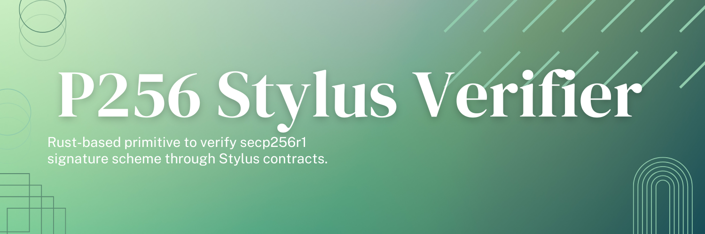
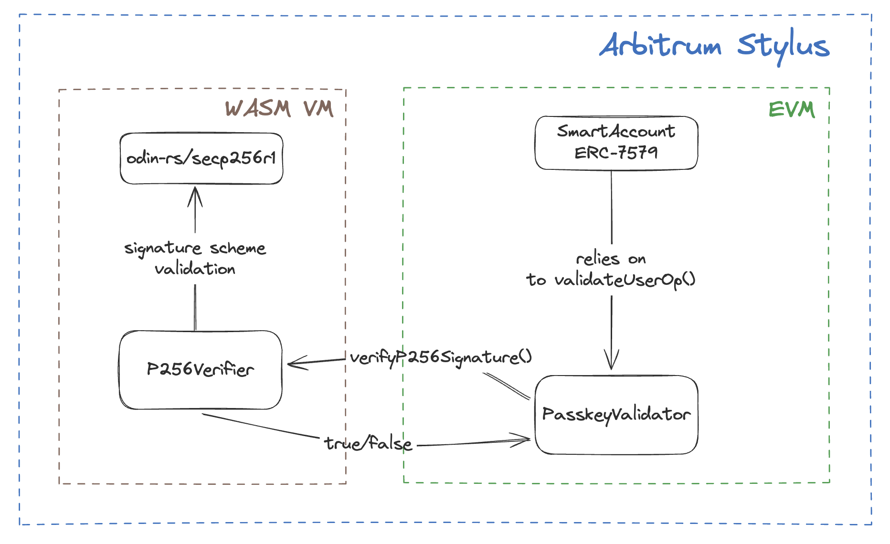

# P256 Stylus-based Verifier

This project leverages Arbitrum's Stylus framework to implement a **secp256r1** signature verification module optimized with Rust for enhanced speed and cost-effectiveness.

Stylus enables Rust-based smart contracts, compiled to WebAssembly (WASM), to achieve significantly faster execution and lower gas costs compared to EVM-based alternatives. By integrating **secp256r1** validation in WASM, this solution reduces e.g. resource demands for Account Abstraction applications, providing a robust, high-performance signature verification process. This Rust-driven approach capitalizes on Stylus' efficiency, making advanced cryptographic verification feasible on-chain.

## How it works



We've created a custom secp256r1 verification [library](https://github.com/gabrielstoica/odin-rs/tree/main/secp256r1) in Rust, as part of the [odin-rs project](https://github.com/gabrielstoica/odin-rs/). This library serves as the foundational layer for signature verification. We chose to develop our own due to current Stylus ecosystem limitations—particularly around randomness—which most p256 libraries rely on in underlying methods. As such, odin-rs/secp256r1 is a lightweight library focused exclusively on p256 signature verification, providing a streamlined, dependency-minimal solution tailored for this purpose.

Through a Stylus-based smart contract, called `P256Verifier`, we're executing the odin-rs/secp256r1 library to perform the signature verification. In this way, thanks to the Arbitrum's EVM equivalence, the `P256Verifier` acts as a middleman between any Solidity-based contract i.e. a WebAuthn.sol that needs to rely on a validator contract to perform the passkey verification.

## Future directions

Current implementation is not the most optimized one. Custom precompiles can be used to further reduce gas fee costs and improve on efficiency. For example, the secp256r1 precompile as per [RIP-7212](https://github.com/ethereum/RIPs/blob/master/RIPS/rip-7212.md) must be implemented as next step.
Also, depending on the math complexity within the `odin-rs/secp256r1` library, the Stylus contract size may exceed the maximum contract size (24.7 KB). We did optimizations and Therefore, further optimizations might be needed to compress the size as much as possible.

## Deployments

**Currently, the P256 verifier has been deployed to Arbitrum Sepolia at the [0x084d90db86d4f6075746b76dc8fbfe5c8cff2700](https://sepolia.arbiscan.io/address/0x084d90db86d4f6075746b76dc8fbfe5c8cff2700#code) address.**

## Quick Start

Install [Rust](https://www.rust-lang.org/tools/install), and then install the Stylus CLI tool with Cargo

```bash
cargo install --force cargo-stylus cargo-stylus-check
```

Add the `wasm32-unknown-unknown` build target to your Rust compiler:

```
rustup target add wasm32-unknown-unknown
```

You should now have it available as a Cargo subcommand:

```bash
cargo stylus --help
```

Then, clone the template:

```
git clone https://github.com/gabrielstoica/passkey-verifier-stylus && cd passkey-verifier-stylus
```

Try to verify a `secp256r1` signature by manually calling the `verifyP256Signature()` method on the deployed instance on Arbitrum Sepolia by running the following command:

```bash
cast call --rpc-url 'https://sepolia-rollup.arbitrum.io/rpc' --private-key {YOUR_PRIVATE_KEY}0x084d90db86d4f6075746b76dc8fbfe5c8cff2700 "verifyP256Signature(string,string,string,string,string)(bool)" "815e09a2bd2fc002455e4f7e27ded6fe16b2d5fb64e794b1330baf43240426c2" "44287010881208015365891457934322412831709505919103389800494869821653003543448" "8406816689267822401861499063555392983685355867895747502381532128270957686385" "68449023142751417849721717863618968034536915122161212084967858248511514843855" "3488552624795641752530543084319869349275815004565195928595219571486160100262"
```

**Note**: this call uses hardcoded values for testing purposes.

### Testnet Information

All testnet information, including faucets and RPC endpoints can be found [here](https://docs.arbitrum.io/stylus/reference/testnet-information).

## License

This project is fully open source, including an Apache-2.0 or MIT license at your choosing under your own copyright.
